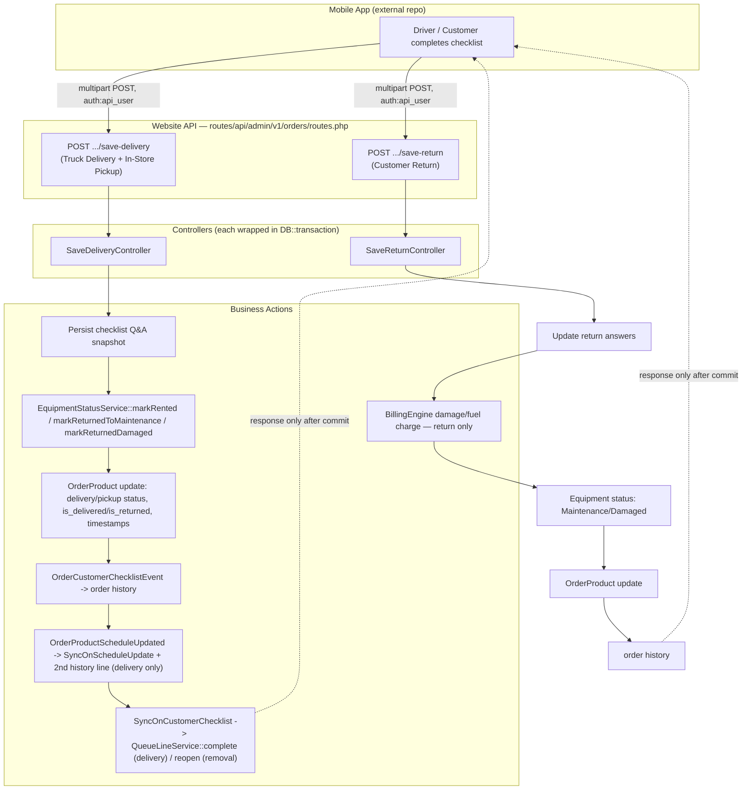

# Phase 1 Audit — Mobile Checklist Communication Verification

**Audit date:** 2026-08-03
**Audit type:** Read-only code audit. No functionality changes, no migrations, no refactors, no API changes were made.
**Branch audited:** `raj_development`
**Scope:** Verify that a checklist completed in the mobile app reliably reaches the website and executes every downstream business action it is responsible for, for exactly three workflows: Truck Delivery Customer Checklist, In-Store Pickup Customer Checklist, Customer Return Checklist. This is explicitly narrower than the full rental lifecycle — no refactors, no architecture redesign, no business-logic changes are proposed here.

**Relationship to prior audits:** This repo already contains an extensive checklist-system audit trail in `docs/checklist-system-audit/` (2026-07-03 initial audit through a completed Correction Phase 1— PRs A1–A4, B1). This Phase 1 audit reuses those findings where still accurate, calls out what has since changed, and adds net-new ground the prior audit did not cover: the Queue Line integration (`app/Listeners/QueueLine/`, built 2026-07-19/07-23, postdates the original audit) and an explicit communication-reliability lens across all three workflows rather than a system-wide architecture review.

---

## 1. Mobile App Investigation

**The mobile app is not in this repository.** This codebase (`d:\Apps\laragon\www\2026\kabba`) is a Laravel monolith serving as the API-only backend. The mobile client is an external codebase consuming JSON endpoints under `api/admin/v1/*`, gated by `auth:api_user`. Everything below about "mobile behavior" (retry, offline queue, duplicate protection) is therefore inferred from what the **server** guards against — the mobile client's actual retry/offline logic is invisible from this repo and was flagged as an explicit unknown in the prior audit (`CHECKLIST_SYSTEM_AUDIT.md` §17).

| Workflow | Endpoint | Controller | Payload | Completion callback | Duplicate protection (server-side) |
|---|---|---|---|---|---|
| Truck Delivery Customer Checklist | `POST orders/customer-checklists/save-delivery` | `SaveDeliveryController` | `order_product_unique_id`, `equipment_unique_id`, `store_id`, `user_id`, `start_hours`, `fuel_initial_reading`, `checklist[]` (question/answer unique ids + amount), `signature_media` (nullable image, ≤2MB) | Synchronous JSON `{success, message}` after full DB commit | 409 if `is_delivered && !is_returned` on a **different** equipment; graceful **success replay** (no re-processing) if identical equipment retried on the same open cycle |
| In-Store Pickup Customer Checklist | Same endpoint, same controller — **no separate route/controller exists** | `SaveDeliveryController` | Identical to above | Identical | Identical — the system does not distinguish this workflow at the API layer at all (see §4) |
| Customer Return Checklist | `POST orders/customer-checklists/save-return` | `SaveReturnController` | `order_product_unique_id`, `store_id`, `user_id`, `end_hours`, `fuel_final_reading`, `fuel_total_charge`, `checklist[]`, `signature_media` | Synchronous JSON via `ApiResponseHelper` (different envelope shape than delivery — see §5) | 409 `ChecklistAlreadySubmitted` if a return signature already exists — **no success replay on retry** (see §7) |

Both `SaveDeliveryRequest`/`SaveReturnRequest::prepareForValidation()` contain defensive parsing for malformed/double-encoded JSON from "weird iOS" clients — direct evidence the mobile client's JSON encoding is not fully trustworthy and the server has had to compensate ad hoc.

**Can the mobile app show "completed" before the website has actually finished processing?** No — both save endpoints are synchronous, single-request, and (as of PR-A2) fully wrapped in `DB::transaction()` including the event dispatch. The mobile app cannot receive a success response until the checklist rows, `OrderProduct` update, equipment status transition, and Queue Line/audit-history side effects have all committed. The unresolved risk is the inverse: a commit that succeeds server-side but whose **response never reaches the client** (dropped connection, client timeout) — see §7, Failure Point 1.

**Offline queue behavior**: entirely client-side and invisible from this repo. No idempotency key, client UUID, or client-generated timestamp exists anywhere in the checklist submission payload — server-side dedup relies entirely on database state (`is_delivered`/`is_returned`/signature presence), not a client-supplied replay token.

---

## 2. Communication Diagram



---

## 3. Checklist Processing Maps

### 3a. Truck Delivery Customer Checklist

```
Route: POST orders/customer-checklists/save-delivery
  -> Controller: SaveDeliveryController (app/Http/Controllers/Api/Admin/V1/Orders/CustomerChecklists/SaveDeliveryController.php)
  -> Validation: SaveDeliveryRequest (exists: order_product, equipment, store, user, questions/answers)
  -> [DB::transaction opens]
     -> Lookup OrderProduct + Equipment; 404 if missing; 409 if equipment already rented on a different order product
     -> 409 guard: reject resubmission for a DIFFERENT equipment on an open (undelivered->not yet returned) cycle
     -> Success-replay short-circuit: identical equipment + already-delivered cycle -> return success WITHOUT reprocessing
     -> Persist: soft-delete stale OrderProductChecklistQuestion(Answers) from a prior equipment assignment,
        then snapshot current master template questions/answers onto order_product_checklist_questions/_answers
     -> EquipmentStatusService::markRented() -> Equipment.current_status = Rented, current_order_id/current_order_product_id set,
        EquipmentStatusLog::recordTransition() written (audit trail)
     -> OrderProduct::update() -> delivery_status='Completed', is_delivered=true, is_returned=false, delivery_date/time (= rental start),
        equipment_id/equipment_details/assigned_by/assigned_at
     -> PR-A4 observability: log (not block) if signature missing / required questions unanswered
     -> event(OrderCustomerChecklistEvent, type=checklist_delivery)
          -> OrderCustomerChecklistListener -> order history row ("... delivery checklist filled and machine delivered.")
          -> SyncOnCustomerChecklist -> sweep all Rental order_products on the order with delivery_status=Completed
               -> QueueLineService::complete(row, VIA_CUSTOMER_CHECKLIST_COMPLETED, equipment_id)
                    -> null-latch: if Queue Line item already completed (e.g. by driver "On My Way" dispatch), NO-OP, original stamp/source preserved
                    -> else: latches completed_at/completed_via/completed_equipment_id now (this IS the fallback completion)
     -> event(OrderProductScheduleUpdated) -> OrderProductScheduleUpdatedListener (2nd order-history row) + SyncOnScheduleUpdate (redundant/no-op re-completion, safe by the same null-latch)
  -> [DB::transaction commits]
  -> API Response: {success:true, message} — or the appropriate 404/409 JSON on failure, transaction rolled back
```

### 3b. In-Store Pickup Customer Checklist

Identical processing map to 3a — **there is no separate code path**. The system has exactly one delivery-type checklist workflow (`OrderCustomerChecklistType::ChecklistDelivery`), used for both truck delivery and in-store pickup. The only real difference between the two is *upstream of this controller*: a truck delivery normally already has a Queue Line completion latched by `CompleteOnDispatchStart` (fired when the driver's status flips to "On My Way" / "Arrived" — see `app/Listeners/QueueLine/CompleteOnDispatchStart.php`), so `SyncOnCustomerChecklist`'s completion call is a no-op replay. An in-store pickup has no driver dispatch step at all, so the checklist submission is the **only** thing that ever completes its Queue Line item — the "fallback" is, in practice, the *sole* mechanism for that path. This satisfies the requirement ("if already completed by Driver Dispatch, leave unchanged; if still Pending/Staged, complete it as the fallback") but only as an emergent property of shared code, not an explicit branch — there is no `if (isTruckDelivery) ... else ...` anywhere.

### 3c. Customer Return Checklist

```
Route: POST orders/customer-checklists/save-return
  -> Controller: SaveReturnController
  -> Validation: SaveReturnRequest
  -> [DB::transaction opens]
     -> Lookup OrderProduct+Equipment; 404 if missing; 409 if equipment not currently Rented; 409 ChecklistAlreadySubmitted if a return signature already exists (NO success-replay path — see Failure Point 4)
     -> Reset stale is_return_answer flags, then mark submitted answers is_return_answer=true (idempotent update, not insert)
     -> Damage detection: any selected answer with is_damaged=true on its master record -> BillingEngine::charge(mobileReturnDamage, cycle-scoped idempotency key) (failure here is caught/logged, never blocks the return)
     -> CustomerDamageStagingService::ingestFromReturnChecklist() (same idempotency key; failures reported internally, never break the return)
     -> Fuel charge (if fuel_total_charge>0) -> ChargeService + BillingEngine bridge, same caught/logged failure pattern
     -> EquipmentStatusService::markReturnedDamaged() OR markReturnedToMaintenance() -> Equipment.current_status = Damaged/Maintenance, EquipmentStatusLog written
        NOTE: current_order_id/current_order_product_id are NOT cleared here — order is still open until later closed
     -> OrderProduct::update() -> pickup_status='Completed', is_returned=true, pickup_date/time, end_hours, damage_status (if damaged)
     -> PR-A4 observability: log (not block) if signature missing / required questions unanswered
     -> event(OrderCustomerChecklistEvent, type=checklist_return)
          -> OrderCustomerChecklistListener -> order history row ("... return checklist filled and machine returned.")
          -> SyncOnCustomerChecklist: NO branch for checklist_return (only checklist_delivery/checklist_removed are handled) -> Queue Line is NOT touched on return (by design — Queue Line models outbound delivery only)
  -> [DB::transaction commits]
  -> API Response: ApiResponseHelper success/error JSON (different shape than delivery's plain response()->json — see §5)
```

**Rental Ready initiation — the one required action that is NOT wired.** `EquipmentStatusService::markReturnedDamaged/markReturnedToMaintenance` only flips `Equipment.current_status`. This makes the unit **eligible** for a Rental Ready inspection (`RentalReadyEligibility::canInspect()` simply checks the unit is not `Rented`) but **fires no event, calls no service, and creates no order-history entry pointing at Rental Ready**. Rental Ready is a fully separate mobile endpoint (`Api\Admin\V1\Orders\RentalReadyChecklists\SaveController`, route `orders/rental-ready-checklists/save-rental-ready`) that a technician must submit independently and manually, with no system-side trigger, reminder, or queue created by the return. Confirmed by direct grep: no reference to Rental Ready anywhere in `SaveReturnController.php`, and by `docs/rental-ready-customer-checklist-audit/PHASE1_VALIDATION.md`, which documents Rental Ready as its own independently-guarded workflow.

---

## 4. Source File Inventory

**Routes**
- `routes/api/admin/v1/orders/routes.php` — `save-delivery`, `save-return`, `remove`, `driver-checklist`, `update-delivery-pickup-inputs`, `save-rental-ready`
- `routes/api/admin/v1/customer_checklists/routes.php` — `question-answers` (question list, read-only, used by mobile to render the form)

**Controllers**
- `app/Http/Controllers/Api/Admin/V1/Orders/CustomerChecklists/SaveDeliveryController.php` — Truck Delivery + In-Store Pickup
- `app/Http/Controllers/Api/Admin/V1/Orders/CustomerChecklists/SaveReturnController.php` — Customer Return
- `app/Http/Controllers/Api/Admin/V1/Orders/CustomerChecklists/RemoveController.php` — operational reversal (staff-triggered, referenced for Queue Line reopen behavior)
- `app/Http/Controllers/Api/Admin/V1/Orders/Schedules/DriverChecklistController.php` — dispatch/driver status (feeds `CompleteOnDispatchStart`, upstream of the delivery checklist for truck deliveries)
- `app/Http/Controllers/Api/Admin/V1/CustomerChecklists/IndexController.php` — question/answer list fetch

**Requests**
- `app/Http/Requests/Api/Admin/V1/Orders/CustomerChecklists/SaveDeliveryRequest.php`
- `app/Http/Requests/Api/Admin/V1/Orders/CustomerChecklists/SaveReturnRequest.php`
- `app/Http/Requests/Api/Admin/V1/Orders/CustomerChecklists/RemoveRequest.php`
- `app/Http/Requests/Api/Admin/V1/Orders/Schedules/DriverChecklistRequest.php`

**Services**
- `app/Services/Equipment/EquipmentStatusService.php` — single authority for equipment status transitions in these workflows
- `app/Services/QueueLine/QueueLineService.php` — single writer of `queue_line_items`; `complete()`/`reopen()`/`requeue()`
- `app/Services/ChecklistManagement/RentalReadyEligibility.php` — gates Rental Ready inspection eligibility (return-side downstream, not triggered)
- `app/Services/BillingEngine.php`, `app/Services/ChargeService.php`, `app/Services/ChargeTaxCalculator.php` — return-side damage/fuel billing
- `app/Services/Service/CustomerDamageStagingService.php` — return-side damage staging record

**Models**
- `app/Models/Orders/OrderProduct.php`, `app/Models/Orders/Order.php`
- `app/Models/Orders/OrderProductChecklistQuestion.php`, `app/Models/Orders/OrderProductChecklistQuestionAnswers.php`
- `app/Models/Orders/QueueLineItem.php`
- `app/Models/MaintenanceManagement/Equipment.php`
- `app/Models/ChecklistManagement/EquipmentChecklist/EquipmentStatusLog.php`

**Events**
- `app/Events/Admin/Orders/OrderCustomerChecklistEvent.php` — fired by SaveDelivery/SaveReturn/Remove
- `app/Events/Admin/Orders/OrderProductScheduleUpdated.php` — fired by SaveDelivery only (not SaveReturn)
- `app/Events/Admin/Orders/OrderProductDriverChecklistUpdated.php` — fired by DriverChecklistController (truck dispatch, upstream)

**Listeners**
- `app/Listeners/Activities/Admin/Orders/OrderCustomerChecklistListener.php` — order history (all 3 workflows)
- `app/Listeners/Activities/Admin/Orders/OrderProductScheduleUpdatedListener.php` — 2nd order history line (delivery only)
- `app/Listeners/QueueLine/SyncOnCustomerChecklist.php` — Queue Line completion (delivery) / reopen (removal)
- `app/Listeners/QueueLine/SyncOnScheduleUpdate.php` — Queue Line reconciliation off schedule status changes
- `app/Listeners/QueueLine/CompleteOnDispatchStart.php` — Queue Line completion off driver "On My Way" (truck path only, upstream of delivery checklist)

**Observers** — none fire in this path directly; equipment status writes deliberately use `saveQuietly()` to bypass `EquipmentObserver`, compensated by explicit `EquipmentStatusLog::recordTransition()` calls (see §6).

**Migrations (this path's tables)**
- `database/migrations/orders/2025_09_05_020320_create_order_product_checklist_questions_table.php`
- `database/migrations/orders/2025_09_05_021505_create_order_product_checklist_question_answers_table.php`
- `database/migrations/orders/2026_07_19_100000_create_queue_line_items_table.php` (unique constraint on `order_product_id` — the DB-level dedup backstop for Queue Line)
- `database/migrations/checklist_mangement/equipment_checklist/2025_12_15_163837_create_equipment_status_logs_table.php`

---

## 5. Communication Verification

| Downstream action | Truck Delivery | In-Store Pickup | Customer Return |
|---|---|---|---|
| API request received & validated | ✅ `SaveDeliveryRequest` | ✅ same | ✅ `SaveReturnRequest` |
| Checklist persisted (Q&A snapshot) | ✅ | ✅ | ✅ (reuses delivery-time snapshot, updates answer flags) |
| Rental started (is_delivered, delivery timestamps) | ✅ | ✅ | N/A (return closes, doesn't start) |
| Order delivery/pickup status updated | ✅ `delivery_status='Completed'` | ✅ | ✅ `pickup_status='Completed'` |
| Equipment status updated (custody/on-rent) | ✅ `markRented()` | ✅ | ✅ `markReturnedToMaintenance/Damaged()` |
| Rental timing started | ✅ `delivery_date`/`delivery_time` | ✅ | N/A |
| Queue Line checked/completed correctly | ✅ via `SyncOnCustomerChecklist` (fallback-safe against dispatch pre-completion) | ✅ (checklist is the *only* completion trigger — no dispatch step exists) | N/A by design — Queue Line models outbound delivery only, not return |
| Audit history recorded | ✅ (2 rows: checklist + schedule-update) | ✅ | ✅ (1 row: checklist only — no 2nd schedule-update row, since `OrderProductScheduleUpdated` isn't fired here) |
| Rental Ready initiated (return only) | — | — | ❌ **NOT wired** — equipment becomes *eligible*, but nothing triggers, schedules, or records that a Rental Ready inspection is now due |
| Successful response returned to mobile | ✅ (incl. graceful success-replay on identical retry) | ✅ | ✅ **but** retry-after-success returns an error, not success (see Failure Point 4) |

**Verdict:** Truck Delivery and In-Store Pickup fully satisfy the required communication chain, including the Queue Line fallback-completion rule, as an emergent property of shared code and the null-latch idempotency design. Customer Return correctly persists, updates order/equipment state, and records audit history — but does **not** initiate Rental Ready in any automated sense, and its retry-after-success behavior can present a false failure to the mobile client.

---

## 6. Failure Points

1. **Response lost after commit (all three workflows).** Every save is wrapped in `DB::transaction()`, so the database is never left half-written — but if the HTTP response is lost after commit (dropped connection, client timeout, app crash), the mobile app has no way to distinguish "never received" from "processed successfully." There is no idempotency key or a "check status of my last submission" endpoint. For delivery, a naive retry with the same equipment is handled gracefully (success replay, no reprocessing). For return, a naive retry hits a 409 error (`ChecklistAlreadySubmitted`) — the mobile app would show a failure for an already-successful return (Failure Point 4, elaborated below).

2. **Validation failure (422).** Handled: request never reaches business logic; the transaction never opens; no partial state. Low risk.

3. **Checklist saves but business logic fails (e.g., equipment lookup mid-transaction throws).** Handled since PR-A2: `DB::transaction()` wraps the entire method including the event dispatch, so any exception rolls back checklist rows, `OrderProduct`, and equipment status together. This closes the gap the original 2026-07-03 audit flagged ("no transactional safety").

4. **Return retry-after-success returns an error, not a success.** `SaveReturnController`'s only duplicate guard is "does a return signature already exist" → 409. Unlike delivery, there is no success-replay branch. A slow/dropped response followed by a legitimate mobile retry will present the driver/customer with an apparent failure for a return that in fact fully succeeded. This is a real (if narrow) communication reliability gap specific to the return workflow.

5. **Queue Line update fails.** `QueueLineService::complete()` runs inside the same enclosing `DB::transaction()` as the rest of `SaveDeliveryController` — an exception here rolls back the whole delivery, which is arguably too strict (a Queue Line bug would incorrectly fail an otherwise-valid delivery) but does guarantee no silent partial state. The `queue_line_items.order_product_id` unique constraint is the DB-level backstop against duplicate rows regardless.

6. **Equipment status update fails.** Same transaction-wrapped guarantee as above — an `EquipmentStatusService` failure rolls back the whole request. `saveQuietly()` bypasses `EquipmentObserver`, which the codebase compensates for with an explicit `EquipmentStatusLog::recordTransition()` call in every `EquipmentStatusService` method (fixed via PR-A1/PR-A1_FOLLOWUP after an interim regression — see `docs/checklist-system-audit/PR-A1_REVIEW.md`). Historical equipment-status data from **before** the PR-A1 deploy remains permanently unreconstructable — `STAKEHOLDER_NOTE_EQUIPMENT_STATUS_LOGS.md` still has an unfilled "(fill in once confirmed with engineering/DevOps)" placeholder for the exact cutoff date, which should be closed out.

7. **Order update fails.** Same transaction guarantee.

8. **Offline synchronization replays the request.** Since there is no client-supplied idempotency token, "replay" is indistinguishable from "genuine new submission" except by database state (is_delivered/is_returned/signature presence). This works for the exact-state cases the code anticipates (same equipment, same cycle) but has not been verified against real mobile offline-queue behavior, which is invisible from this repo (unresolved in the original audit, still unresolved here).

9. **Rental Ready never gets initiated.** Not a communication *failure* in the request/response sense — the return request itself succeeds completely — but it is a real gap against the requirement "initiates the Rental Ready workflow." Today, nothing initiates it; a unit can sit indefinitely in Maintenance/Damaged status with no reminder, job, or queue entry telling a technician a Rental Ready inspection is due.

10. **Billing correctness on return (adjacent, not strictly "communication," but affects whether the return's business actions are fully correct).** The multi-cycle idempotency-key fix (PR-A3) is code-complete and tested, but per `PR-A3_BILLING_IDEMPOTENCY.md` §6 remains **NO-GO for production deployment** pending finance/accounting reconciliation of historical impact. If that gate is still in effect, live returns on a re-rented order product may still silently drop a legitimate second damage/fuel charge. **This should be confirmed with finance/DevOps before treating this audit as reflecting production reality** — the code fix existing does not guarantee it is deployed.

---

## 7. Recommended Corrections (minimum set, before the full lifecycle audit)

1. **Add a success-replay path to `SaveReturnController`** mirroring `SaveDeliveryController`'s: if a return signature already exists for the exact same equipment/cycle, return the original success response instead of a 409, so a lost-response retry cannot present a completed return as a failure.
2. **Wire an explicit Rental Ready trigger off the return workflow** — at minimum, an event (`OrderProductReturnedEvent` or similar) that a Rental Ready listener can act on (create a queue/reminder, or auto-notify the shop), even without changing the Rental Ready submission flow itself. This is the one clearly-missing link in the chain the user described.
3. **Confirm and close out the production-deploy status of PR-A3 (billing idempotency)** with finance/DevOps — this audit cannot determine from code alone whether the NO-GO gate has been lifted.
4. **Fill in the still-open cutoff date in `STAKEHOLDER_NOTE_EQUIPMENT_STATUS_LOGS.md`** so it's unambiguous which historical equipment-status data is and isn't reconstructable.
5. **Consider a lightweight idempotency key from the mobile client** (even a client-generated UUID echoed back) for both save endpoints, to make offline-queue replay detection authoritative rather than inferred from database state — directly addresses Failure Points 1 and 8.
6. **Standardize the response envelope** between `SaveDeliveryController` (plain `response()->json`) and `SaveReturnController` (`ApiResponseHelper`) — not a reliability bug today, but a real risk if the mobile client's response-parsing logic assumes one shape and silently mishandles the other on an error path.

None of the above requires a schema change, a refactor of business logic, or centralizing services — consistent with this phase's scope limitation. The full lifecycle dependency audit should follow once these are resolved or explicitly deferred.
